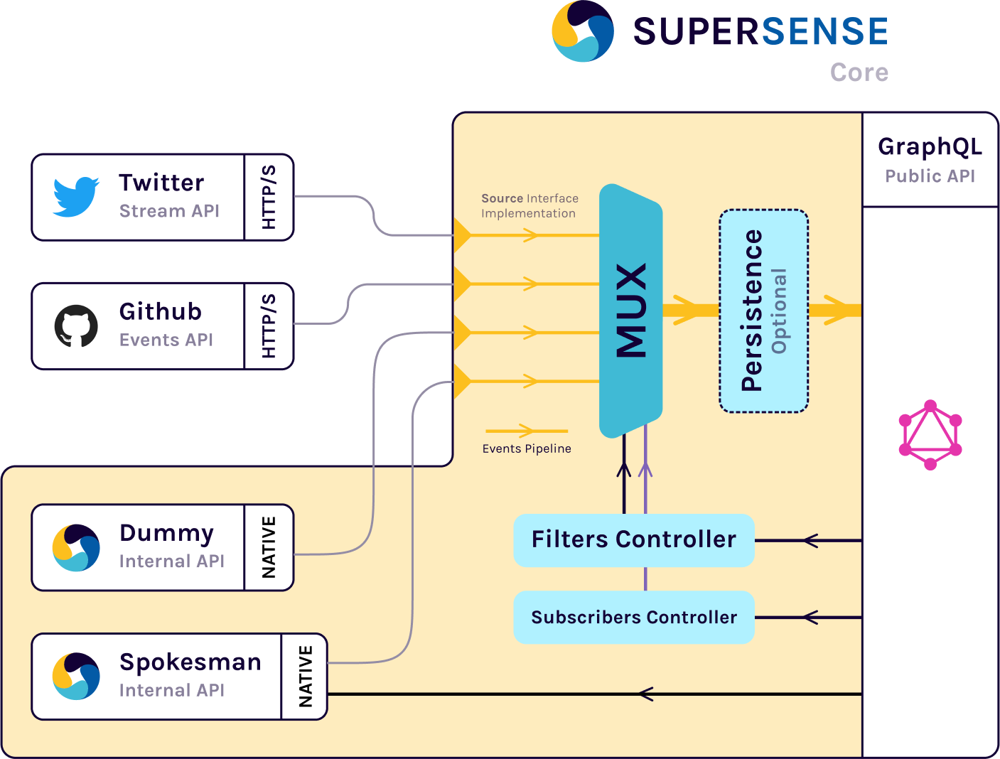

# Supersense

Supersense is a simple and customizable event board. The main goal of supersense is given an open source alternative to the social walls or multiple source event trackers. At the moment, supersense implements only two sources: Twitter & Github, but the architecture was development in a scalable and extendable way.

## Technology

Supersense was created with a micro-service paradigm in mind, is a stateless service easy to horizontal scale (but also can have persistence and to be an stateful service). The project has two principal services called: **Core** and **Observer**, each one is distributed using docker images and published in the DockerHub with the tags **minskylab/supersense** and **minskylab/supersense-observer** respectively.

### About the stack

**Core**

Supersense Core was written in [Go](https://golang.org/) and uses [GraphQL](https://graphql.org) as API layer to communicate with the observer or any other custom API consumer, the main goal of core is provide a powerful and realtime API to broadcast all the events coming from the configurase sources (Twitter, Github, etc...).

**Observer**

Supersense Observer was build with [Typescript](https://www.typescriptlang.org/) and [React](https://reactjs.org/), and all the source are bundled* using [snowpack](https://www.snowpack.dev/) a interesting modern technology that use a modern feature called [ESM](https://hacks.mozilla.org/2018/03/es-modules-a-cartoon-deep-dive/) (ES Modules) to distribute files in a unbundled mode, hence we have very fast development flow.

\* Snowpack offers two ways to use it, with its unbundled proposal using ESM and another where you can use the classical bundlers (like Webpack, Parcel).

### Architecture




### Getting Started

Write a config file as a env variables in a .env file like:

```dotenv
SS_GRAPHQL_PLAYGROUND=true

SS_TWITTER_CONSUMER_KEY=<YOUR_TWITTER_CONSUMER_KEY>
SS_TWITTER_CONSUMER_SECRET=<YOUR_TWITTER_CONSUMER_SECRET_KEY>
SS_TWITTER_ACCESS_TOKEN=<YOUR_TWITTER_ACCESS_TOKEN_KEY>
SS_TWITTER_ACCESS_SECRET=<YOUR_TWITTER_ACCESS_SECRET_KEY>
SS_TWITTER_QUERY="#peru"

SS_GITHUB_TOKEN=<GITHUB_TOKEN>
SS_GITHUB_REPOS=minskylab/supersense,minskylab/figport,minskylab/base
```

Build and run Core Service:

```shell script
$ go build -o supersense cmd/* && ./supersense
```

Observer:

```shell script
$ cd observer
$ yarn # in order to download dependencies
$ yarn start
```


// TODO

// TODO


## Configuration

Currently supersense only accepts one way to config the service parameters: the environment variables. Below you can see all of this variables.

| Environment Variable Name      | Default Value | Description |
| ------------------------------ | :------------ | ----------- |
| SS_PORT                        | 4000          |             |
| SS_TWITTER_CONSUMER_KEY        | -             |             |
| SS_TWITTER_CONSUMER_SECRET     | -             |             |
| SS_TWITTER_ACCESS_TOKEN        | -             |             |
| SS_TWITTER_ACCESS_SECRET       | -             |             |
| SS_TWITTER_QUERY               | -             |             |
| SS_GITHUB_TOKEN                | -             |             |
| SS_GITHUB_REPOS                | -             |             |
| SS_DUMMY_PERIOD                | -             |             |
| SS_DUMMY_MESSAGE               | -             |             |
| SS_SPOKESMAN                   | false         |             |
| SS_SPOKESMAN_NAME              | -             |             |
| SS_SPOKESMAN_USERNAME          | -             |             |
| SS_SPOKESMAN_EMAIL             | -             |             |
| SS_PERSISTENCE                 | false         |             |
| SS_PERSISTENCE_BOLTDB_FILEPATH | -             |             |
| SS_PERSISTENCE_REDIS_ADDRESS   | -             |             |
| SS_PERSISTENCE_REDIS_PASSWORD  | -             |             |
| SS_GRAPHQL_PLAYGROUND          | false         |             |


// TODO